# Hallmark

**A design skill for Claude Code, Cursor, and Codex that refuses to look AI-generated.**

[Live demo →](https://www.usehallmark.com) &nbsp;·&nbsp; twenty themes &nbsp;·&nbsp; five verbs &nbsp;·&nbsp; press `T` to cycle.

Made by Together AI.

<p align="center">
  
</p>

Hallmark picks a macrostructure for the brief, dresses it in one of twenty themes, runs fifty-eight slop-test gates plus a pre-emit self-critique, and refuses the on-distribution defaults every LLM was trained into. Two pages by Hallmark for two different briefs feel like different sites, not colour-swaps of the same template.

---

## Five verbs

| Verb | What it does |
| --- | --- |
| *(default)* | Build new UI. Picks a macrostructure, applies the rule-set, runs the slop test before handing back. |
| `hallmark audit <target>` | Score existing code against the anti-patterns. Punch list, no edits. |
| `hallmark redesign <target>` | Throw out the structure, keep copy + IA + brand, rebuild with a different fingerprint. |
| `hallmark study <screenshot \| URL>` | Extract the **DNA** from a design you admire: macrostructure, type-pairing, colour anchor. Refuses pixel-clones and paid templates. Optionally emits a portable `design.md` for handoff to other AI tools. |
| `hallmark variants <brief>` | Three structurally distinct directions for one brief, rendered live. Flip through them in a picker over your own localhost, pick one, keep building. |

---

## Different briefs, different shapes

Each generated from a different brief. The skill picks the theme, structure, and craft to fit each one, not from a template.

<table>
  <tr>
    <td width="25%"><a href="https://www.usehallmark.com/examples/hum-07/">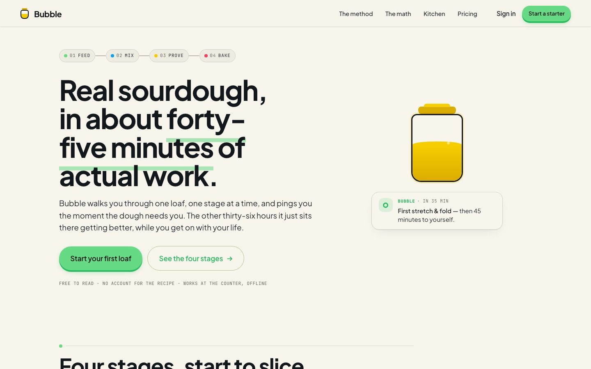</a></td>
    <td width="25%"><a href="https://www.usehallmark.com/examples/cobalt-01/">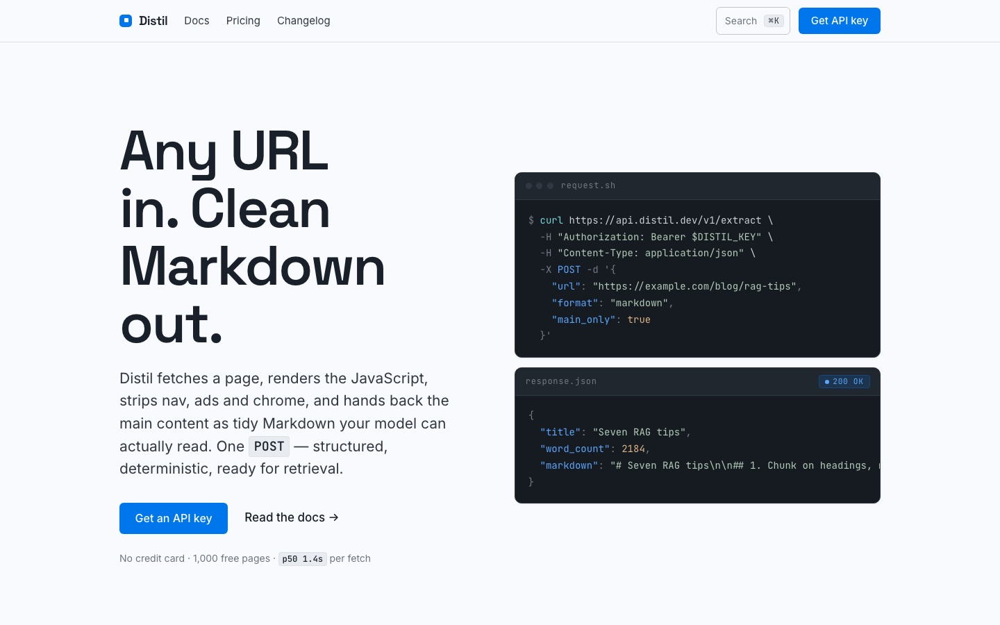</a></td>
    <td width="25%"><a href="https://www.usehallmark.com/examples/carnival-01/">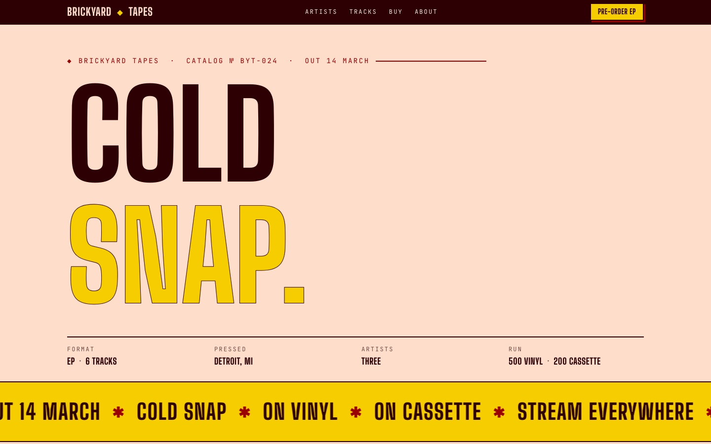</a></td>
    <td width="25%"><a href="https://www.usehallmark.com/examples/lumen-01/">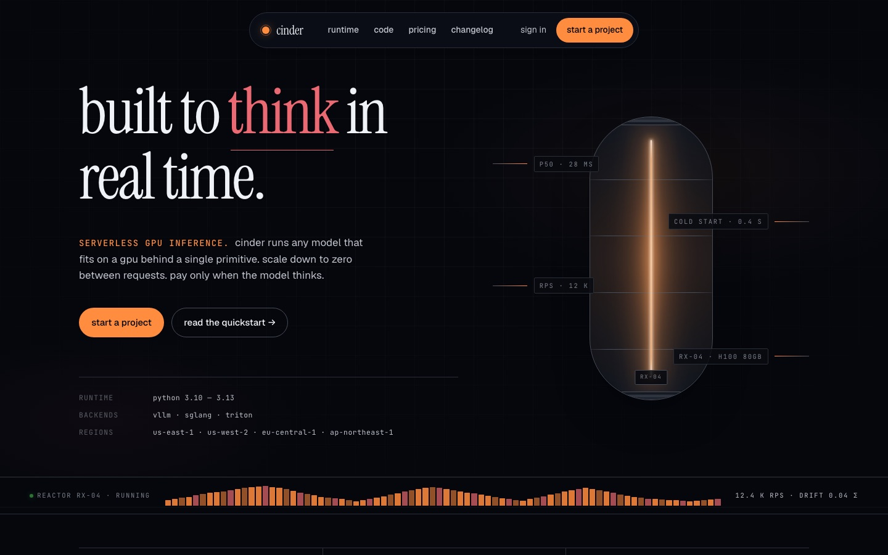</a></td>
  </tr>
  <tr>
    <td><b>Bubble</b><br/><sub>Sourdough app · Hum</sub></td>
    <td><b>Distil</b><br/><sub>Extraction API · Cobalt</sub></td>
    <td><b>Cold Snap</b><br/><sub>Record label · Carnival</sub></td>
    <td><b>Cinder</b><br/><sub>AI tool · Lumen</sub></td>
  </tr>
  <tr>
    <td><a href="https://www.usehallmark.com/examples/custom-03/">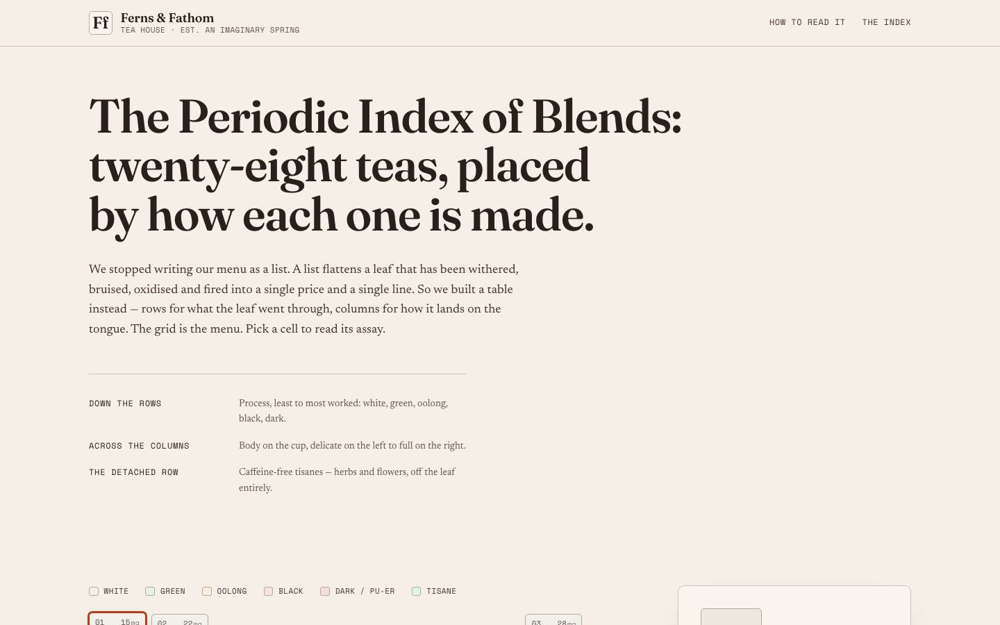</a></td>
    <td><a href="https://www.usehallmark.com/examples/garden-01/">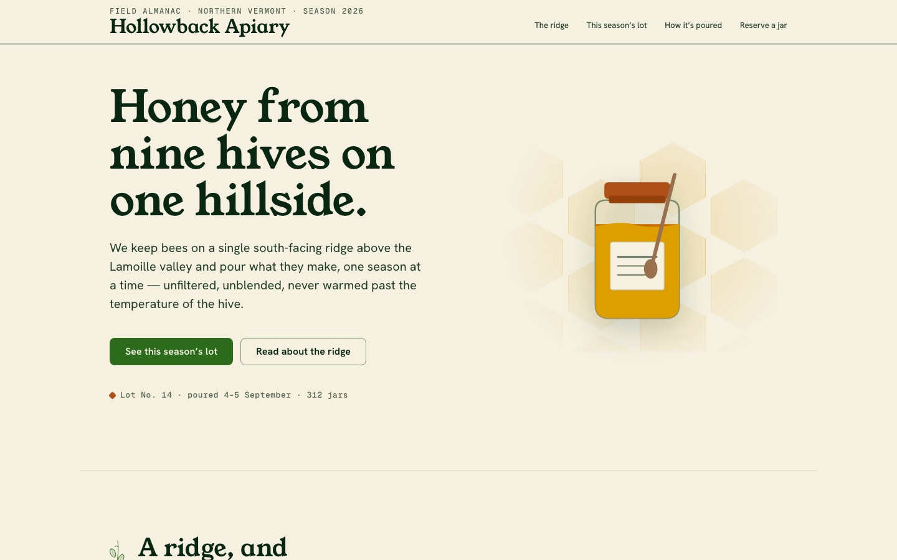</a></td>
    <td><a href="https://www.usehallmark.com/examples/riso-01/">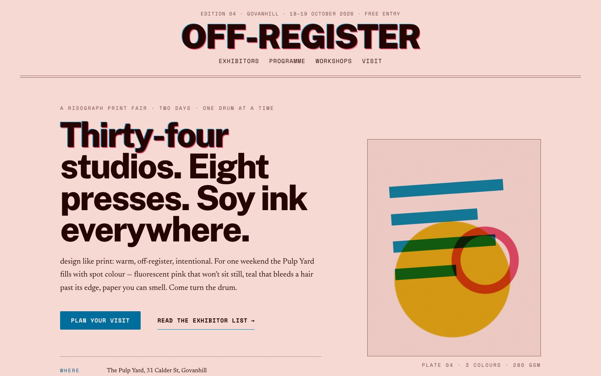</a></td>
    <td><a href="https://www.usehallmark.com/examples/press-01/">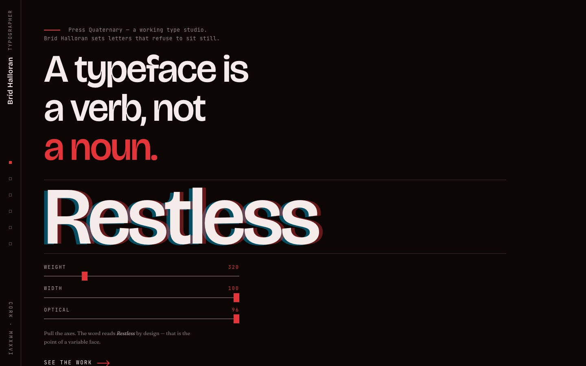</a></td>
  </tr>
  <tr>
    <td><b>Ferns &amp; Fathom</b><br/><sub>Tea menu · Custom</sub></td>
    <td><b>Hollowback Apiary</b><br/><sub>Honey farm · Garden</sub></td>
    <td><b>Off-Register</b><br/><sub>Print fair · Riso</sub></td>
    <td><b>Press Quaternary</b><br/><sub>Type studio · Custom</sub></td>
  </tr>
  <tr>
    <td><a href="https://www.usehallmark.com/examples/tally/">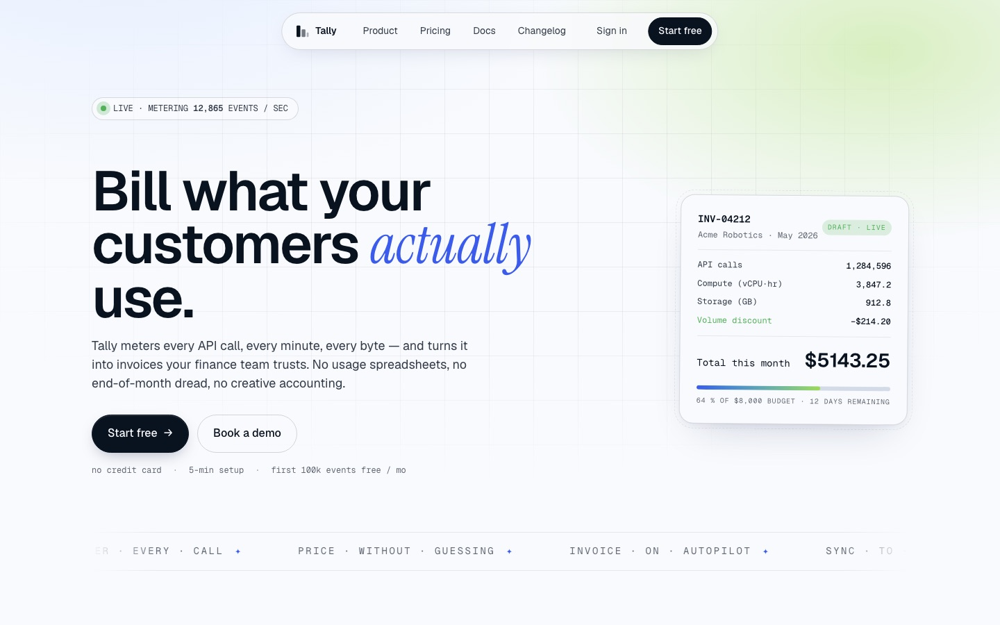</a></td>
    <td><a href="https://www.usehallmark.com/examples/wayfare/">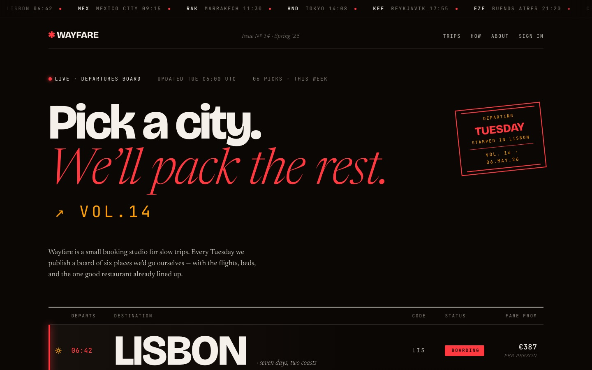</a></td>
    <td><a href="https://www.usehallmark.com/examples/najm/">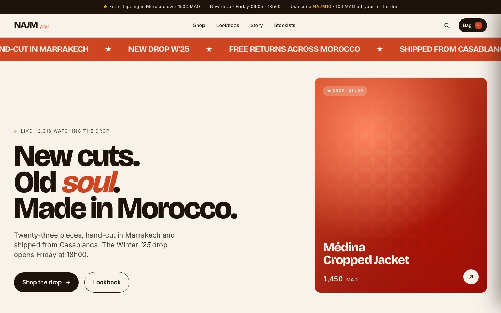</a></td>
    <td><a href="https://www.usehallmark.com/examples/hyperlane/">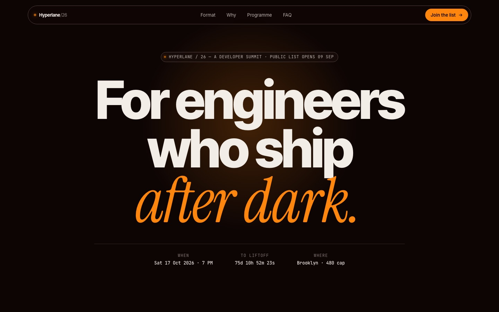</a></td>
  </tr>
  <tr>
    <td><b>Tally</b><br/><sub>SaaS · modern-minimal</sub></td>
    <td><b>Wayfare</b><br/><sub>Travel · atmospheric</sub></td>
    <td><b>NAJM</b><br/><sub>Fashion brand</sub></td>
    <td><b>Hyperlane</b><br/><sub>Dev infrastructure</sub></td>
  </tr>
</table>

Each page is self-contained HTML + CSS, stamped with its macrostructure in the CSS comment. Browse the full set at [usehallmark.com](https://www.usehallmark.com) or under [`site/_tests/`](site/_tests/).

---

## Custom

When a brief carries creative intent that no catalog theme fits, Hallmark switches to **Custom** and designs the page from scratch: a made-to-measure palette, type, and layout. Same 58 slop-test gates, no template underneath.

In v1.2 the custom route runs a full art-direction ritual: it names and rejects the category's reflex aesthetics, writes a slate of seven grounded directions, and a deterministic **draw** (`scripts/seed.mjs`) picks which one gets built, sometimes dealing wildcards from a design-history atlas. A scene sentence sets the light, a colour posture (Restrained · Committed · Full palette · Drenched) sets how far the palette commits, and a five-block direction contract written into the artifact gets audited promise by promise before shipping.

<table>
  <tr>
    <td width="50%"><a href="https://www.usehallmark.com/examples/custom-02/">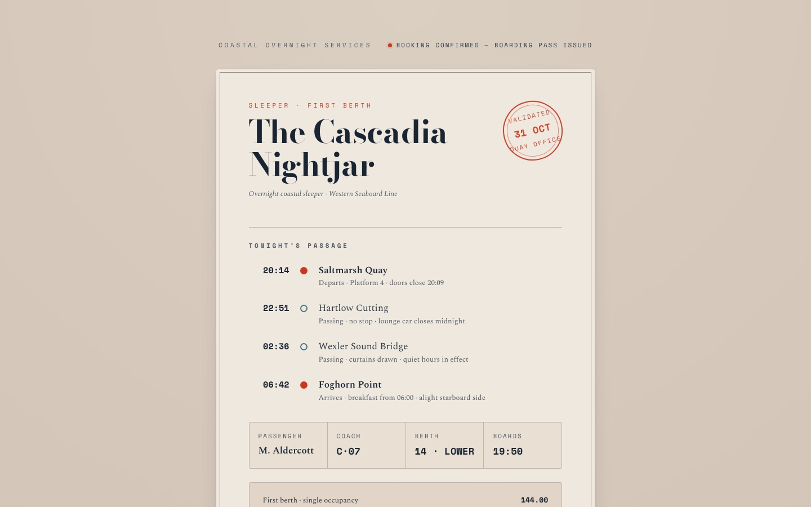</a></td>
    <td width="50%"><a href="https://www.usehallmark.com/examples/custom-04/">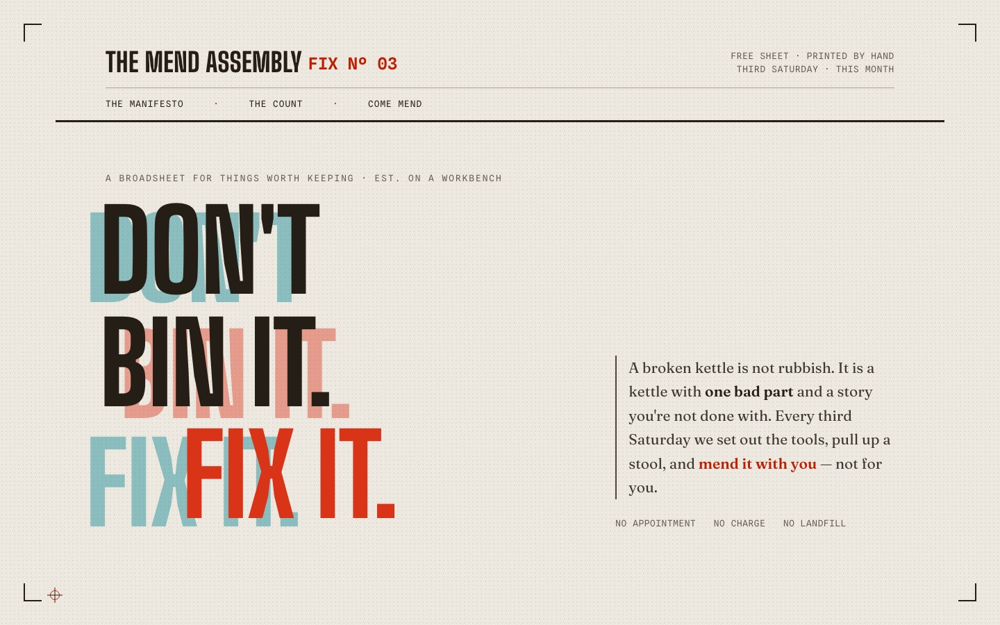</a></td>
  </tr>
  <tr>
    <td><b>The Cascadia Nightjar</b><br/><sub>Sleeper-train ticket · Custom</sub></td>
    <td><b>The Mend Assembly</b><br/><sub>Repair-café broadsheet · Custom</sub></td>
  </tr>
</table>

It stays a quiet branch; vanilla briefs never see it. The protocol lives in [`custom-theme.md`](skills/hallmark/references/custom-theme.md).

---

## Variants <sup>NEW</sup>

`hallmark variants <brief>` runs the ceremony once, then builds **three complete directions**: different macrostructure, different theme (one dark, one mid, one light paper, forced), different nav, different footer. A tiny zero-dependency picker server (`skills/hallmark/scripts/variants/`) shows all three as live frames; in an existing app each direction is a temporary route your own dev server renders, with a small chip in the corner to flip and pick. Choose one and Hallmark promotes it, archives the others under `.hallmark/variants/`, and logs the whole run. Say `riff` for a fourth direction. No Node available? The picker degrades to a static compare page, and a chat reply ("pick 2") always works.

---

## Open models <sup>NEW</sup>

Hallmark v1.2 is written to hold up on open-weight models, not just Claude. The mechanically checkable gates now live in a zero-dependency checker the model runs instead of eyeballing:

```
node skills/hallmark/scripts/sloplint.mjs <file-or-dir> --genre <genre>
```

The skill carries a Critical floor that survives truncated reads, text-only fallbacks for every visual check (GLM has no vision; the skill knows), and a per-model quirks file ([`references/models.md`](skills/hallmark/references/models.md)) that loads only off-Claude.

Run it inside Claude Code on an open model via an Anthropic-compatible endpoint:

```bash
# GLM (Z.ai)                                  # Kimi (Moonshot)
export ANTHROPIC_BASE_URL=https://api.z.ai/api/anthropic
export ANTHROPIC_AUTH_TOKEN=<zai key>         # ANTHROPIC_BASE_URL=https://api.moonshot.ai/anthropic
export ANTHROPIC_MODEL="glm-5.2[1m]"          # ANTHROPIC_MODEL=kimi-k3
```

The `[1m]` suffix on GLM is load-bearing; dropping it silently shrinks the context. Kimi Code CLI users: it discovers skills in `~/.claude/skills/` only, so install Hallmark there rather than as a plugin.

---

## Edit-time linting <sup>NEW</sup>

By default the slop test runs once, at the end. On Claude Code you can move it to the keystroke: a PostToolUse hook lints every `.html`/`.css` Hallmark artifact the moment it is written and feeds any failures back to the model advisorily, so slop gets fixed while the context is small instead of in a big end-of-run pass.

```bash
node skills/hallmark/scripts/install-hook.mjs
```

`--global` targets `~/.claude/settings.json` (all projects); `--print` shows the settings block without writing; `--remove` undoes it. The hook is **advisory only**: it never blocks or reverts a write, no-ops silently on non-artifacts, and the Step 7 sweep still runs regardless. It is Claude-Code-only (Cursor/Codex have no hook surface and rely on Step 7).

---

## Install

```
npx skills add nutlope/hallmark
```

Re-run any time to update. Or copy [`SKILL.md`](skills/hallmark/SKILL.md) + [`references/`](skills/hallmark/references/) into:

- **Claude Code**: `~/.claude/skills/hallmark/`
- **Cursor**: `.cursor/rules/hallmark.mdc` (body of `SKILL.md`, no frontmatter; this channel ships no scripts, so `variants` picks by chat reply and the slop test runs fully model-judged)
- **Codex**: `~/.codex/skills/hallmark/` (personal) or `.codex/skills/hallmark/` (project-scoped)

The rule-set lives in [`SKILL.md`](skills/hallmark/SKILL.md) and [`references/`](skills/hallmark/references/). Worked examples in [`docs/recipes.md`](docs/recipes.md) and [`docs/study-examples.md`](docs/study-examples.md).

---

## Licence

MIT. Use it, fork it, ship it.
